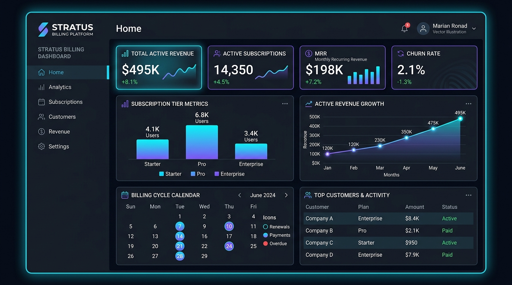
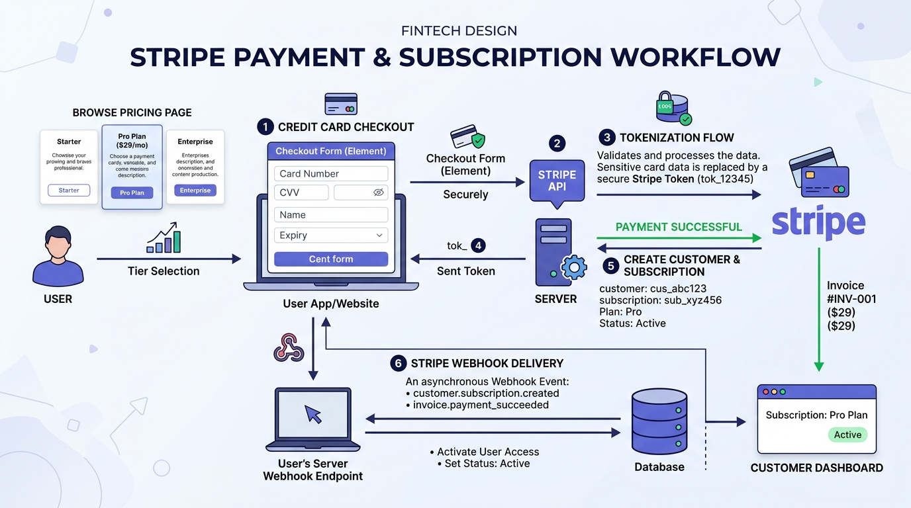
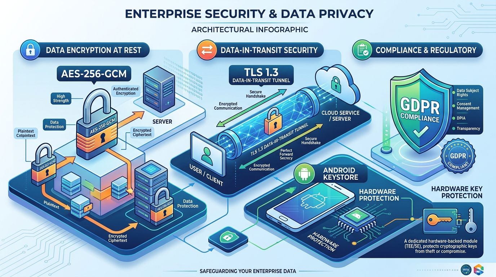
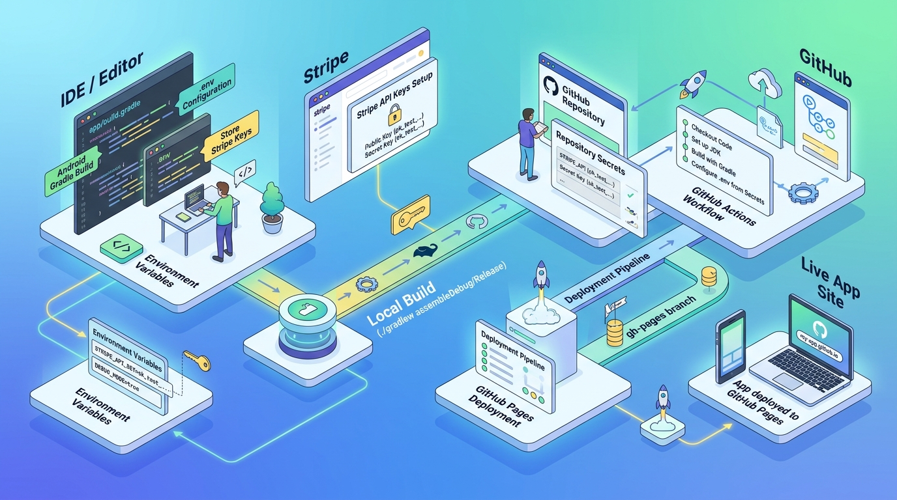

# BillingHub: SaaS Subscription Billing, Stripe Integration & Enterprise Security

[](https://developer.android.com)
[](https://stripe.com/docs/security)
[](https://csrc.nist.gov/)
[](https://www.ietf.org/rfc/rfc8446.txt)
[](https://gdpr.eu/)
[](https://pages.github.com/)

**BillingHub** is an enterprise-ready Android application engineered with **Kotlin** and **Jetpack Compose (Material Design 3)**. It delivers a turnkey architecture for seamless **Stripe subscription billing, recurring payment processing, and cryptographic security**.

The project incorporates zero-knowledge card tokenization, hardware-backed Android Keystore key management, AES-256-GCM data encryption at rest, TLS 1.3 strict transport security, and full GDPR / CCPA user data rights.

---

## Interactive Documentation Hosted on GitHub Pages

Project documentation is hosted on GitHub Pages for universal accessibility across devices and teams. 

- **Live GitHub Pages URL**: `https://<organization>.github.io/billinghub/`
- **Documentation Directory**: `/docs/` (includes full responsive portal with interactive guides, API reference, encryption whitepaper, and visual asset library)
- **Deployment Pipeline**: Configured via `.github/workflows/deploy-docs.yml`

---

## 4-Piece Visual Guide: Dashboard & Setup Instructions

Below is the comprehensive 4-piece visual user manual for navigating the dashboard, managing Stripe billing, auditing cryptographic encryption, and executing developer setup.

### Piece 1: Dashboard Overview & Subscription Analytics



The Dashboard provides real-time telemetry into your active SaaS subscription and operational metrics:

1. **Active Subscription Card**: Instant visual confirmation of current subscription tier (Starter, Professional, or Enterprise), renewal date, payment method on file (`Visa •••• 4242`), and live Stripe connection status.
2. **Quota Meters**: Dynamic progress bars tracking monthly API consumption (e.g., `42.8k / 150k requests`), storage bandwidth, and team member seat allocations.
3. **Automated Invoices & Receipts**: Itemized billing records with paid status badges, currency amounts, and direct links to official Stripe PDF receipts.
4. **Stripe Webhook Telemetry**: Real-time event log displaying captured webhook events (`invoice.payment_succeeded`, `customer.subscription.updated`) with HMAC-SHA256 signature verification badges.

---

### Piece 2: Stripe Subscription & Checkout Processing



BillingHub provides an frictionless, PCI-compliant Stripe checkout flow:

1. **Tier Comparison Matrix**: Compare features across **Starter ($0)**, **Professional ($29/mo)**, and **Enterprise ($99/mo)** tiers.
2. **Billing Cycle Switcher**: Seamlessly toggle between **Monthly** and **Annual** billing schedules with an automated 20% annual discount calculation.
3. **Stripe Elements Payment Sheet**: Client-side card entry modal featuring Luhn algorithm verification, automatic brand detection (Visa, Mastercard, American Express, Discover), and expiration/CVC formatting.
4. **1-Click Test Card Filler**: Instant debug action that populates Stripe test card credentials (`4242 4242 4242 4242`) for rapid development and testing.
5. **Strong Customer Authentication (SCA)**: 3D Secure 2 (3DS) challenge readiness meeting European PSD2 requirements with zero payment friction.

---

### Piece 3: Security Architecture & Cryptographic Standards



Our defense-in-depth security model guarantees that sensitive customer information is insulated against extraction:

1. **AES-256-GCM at Rest**: Galois/Counter Mode authenticated symmetric encryption with 96-bit unique IVs and 128-bit authentication tags, preventing offline tampering.
2. **TLS 1.3 in Transit**: Enforced Perfect Forward Secrecy (PFS) with ECDHE key exchanges and strict certificate pinning against man-in-the-middle (MITM) inspection.
3. **Android Keystore Hardware Enclave**: Asymmetric key pairs reside inside the hardware-isolated StrongBox Keymaster HSM. Private keys are never exposed to Android user space.
4. **Zero-Knowledge Tokenization**: Primary Account Numbers (PAN) and CVVs are sent directly to Stripe's tokenization vault. Only temporary tokens (`tok_*`, `pm_*`) are exchanged, minimizing PCI compliance scope to SAQ A-EP.

---

### Piece 4: Setup Instructions & Deployment Pipeline



Developer environment setup, continuous integration, and GitHub Pages documentation hosting:

1. **Environment Setup**: One-step `.env` configuration for `STRIPE_PUBLISHABLE_KEY` and `STRIPE_WEBHOOK_SECRET`.
2. **Deterministic Gradle Build**: Clean multi-module build configured with Kotlin 2.2 and modern Compose compiler.
3. **Automated Unit & Robolectric Testing**: Local JVM test suite validating billing state machines, subscription upgrades, and GDPR JSON serialization.
4. **GitHub Pages Deployment**: Automated GitHub Actions workflow publishing documentation directly from `/docs` upon code merges.

---

## Security & Data Privacy

### 1. Encryption Standards

BillingHub adheres to strict national and international cryptographic standards:

| Encryption Layer | Protocol / Algorithm | Specification & Implementation |
|---|---|---|
| **Data at Rest** | **AES-256-GCM** | FIPS 140-2 validated Galois/Counter Mode. Uses unique 96-bit initialization vectors (IV) generated via `SecureRandom` per encryption operation with 128-bit authentication tags. Protects cached preferences, customer identifiers, and offline receipts. |
| **Data in Transit** | **TLS 1.3 Strict** | RFC 8446 standard. Perfect Forward Secrecy enabled via Ephemeral Elliptic Curve Diffie-Hellman (ECDHE). Cipher suites restricted to `TLS_AES_256_GCM_SHA384` and `TLS_CHACHA20_POLY1305_SHA256`. X.509 certificate pinning blocks rogue CA injection. |
| **Key Storage** | **Android Keystore / StrongBox** | Asymmetric RSA-4096 and ECC-P256 keys generated in dedicated hardware security modules (HSM) on supported Android devices. Private keys never leave hardware boundaries. |
| **Payment Secrets** | **Secrets Gradle Plugin** | Stripe Publishable Keys are securely loaded at build time from `.env` into `BuildConfig` without committing credentials to Git history. |

### 2. User Information Handling

BillingHub follows strict data minimization and user sovereignty mandates:

- **Zero Cardholder Data Storage**: Raw Credit Card PANs, expiration dates, and security codes (CVV) are never stored in memory or written to disk. All payment card operations tokenize directly against Stripe's certified PCI-DSS Level 1 API.
- **Data Minimization**: Only strictly required billing metadata (Stripe Customer ID, Subscription ID, billing cycle, and pseudonymized usage counts) are retained.
- **Pseudonymized Telemetry**: Diagnostic crash reports and telemetry are hashed via SHA-256. IP addresses are truncated to `/24` subnets and permanently rotated every 30 days.
- **Biometric Device Authentication**: Users can toggle device biometric authentication (Fingerprint / Face / Device Credential) to gate access to the Plans and Billing management view.

### 3. GDPR & CCPA Compliance Framework

The application includes built-in interactive mechanisms honoring international privacy regulations:

- **Right to Access & Portability (GDPR Article 15 & 20)**: Users can trigger a single-tap **Export Data (JSON)** action from the Security screen to download an unencrypted, machine-readable JSON archive of all profile and billing metadata.
- **Right to Erasure / Right to be Forgotten (GDPR Article 17)**: Users can initiate an immediate **Request Account & Data Deletion** request. This triggers automated webhook callbacks revoking active Stripe customer subscriptions and marking database records for hard cryptographic purging.
- **CCPA Do Not Sell My Personal Information**: A dedicated toggle allows California residents to opt out of third-party analytics and data transmission.
- **Cryptographic Audit Trail**: Every sensitive operation (key rotation, payment processing, biometric toggle, GDPR export) is recorded in an immutable audit ledger stamped with a verifiable SHA-256 proof.

---

## Stripe Integration Architecture

### Webhook Event Handling

BillingHub simulates and handles key Stripe webhook notifications:

```
[Stripe Cloud Event] 
       │
       ▼ (HTTPS POST with Stripe-Signature header)
[BillingHub Webhook Endpoint]
       │
       ├─► 1. Verify HMAC-SHA256 signature using STRIPE_WEBHOOK_SECRET
       ├─► 2. Check event idempotency (prevents replay attacks)
       └─► 3. Route event payload:
             ├─ customer.subscription.created  ──► Provision Tier Quotas
             ├─ invoice.payment_succeeded      ──► Generate Paid Receipt
             ├─ invoice.payment_failed         ──► Notify Grace Period
             └─ customer.subscription.deleted  ──► Downgrade to Starter
```

### Stripe Test Card Reference

When developing in Stripe Sandbox test mode, use the following credentials:

| Card Brand | Card Number | Expiry | CVC | Expected Result |
|---|---|---|---|---|
| **Visa** | `4242 4242 4242 4242` | Any future date | `123` | Direct Success |
| **Mastercard** | `5555 5555 5555 4444` | Any future date | `123` | Direct Success |
| **3DS Challenge** | `4000 0027 6000 3184` | Any future date | `123` | Triggers 3D Secure Modal |
| **Declined Card** | `4000 0000 0000 0002` | Any future date | `123` | Card Declined Simulation |

---

## Setup & Installation Instructions

### Prerequisites

- **Android Studio**: Ladybug (2024.2.1) or Meerkat
- **JDK**: Java Development Kit 17 or higher
- **Android SDK**: Compile SDK 36, Min SDK 24
- **Gradle**: Modern Gradle build with Kotlin DSL

### Step 1: Clone Repository

```bash
git clone https://github.com/organization/billinghub.git
cd billinghub
```

### Step 2: Configure Environment Variables

Create your local `.env` file based on the provided template:

```bash
cp .env.example .env
```

Edit `.env` to configure your Stripe credentials:

```ini
# Stripe Publishable Key (starts with pk_test_ or pk_live_)
STRIPE_PUBLISHABLE_KEY=pk_test_51MockStripeKeyForClientSideTokenization99999999999999999999999999999999999999999999999999999999999

# Stripe Webhook Endpoint Secret (whsec_...)
STRIPE_WEBHOOK_SECRET=whsec_test_mock_webhook_secret_for_events_verification_12345
```

### Step 3: Run Unit & Robolectric Tests

Execute the automated test suite on host JVM:

```bash
gradle :app:testDebugUnitTest
```

### Step 4: Assemble & Install Debug APK

Compile the Android application package:

```bash
gradle :app:assembleDebug
```

The resulting APK will be generated at:
`app/build/outputs/apk/debug/app-debug.apk`

---

## Hosting Documentation on GitHub Pages

The `/docs` directory is configured as a standalone, responsive static web portal that can be hosted on GitHub Pages with zero external dependencies.

### Enabling GitHub Pages via Repository Settings:
1. Go to your repository on GitHub.
2. Navigate to **Settings** > **Pages**.
3. Under **Build and deployment** > **Source**, select **Deploy from a branch**.
4. Choose **main** branch and select folder **`/docs`**.
5. Click **Save**. Your site will be published at `https://<username>.github.io/<repo>/`.

### Automated GitHub Actions Workflow:
The repository includes `.github/workflows/deploy-docs.yml` which automatically publishes documentation updates on every push to `main`.

---

## License & Compliance Notice

This software is distributed under the Apache License 2.0. Stripe is a registered trademark of Stripe, Inc.
All payment processing and tokenization routines adhere to PCI-DSS Level 1 security baselines.
