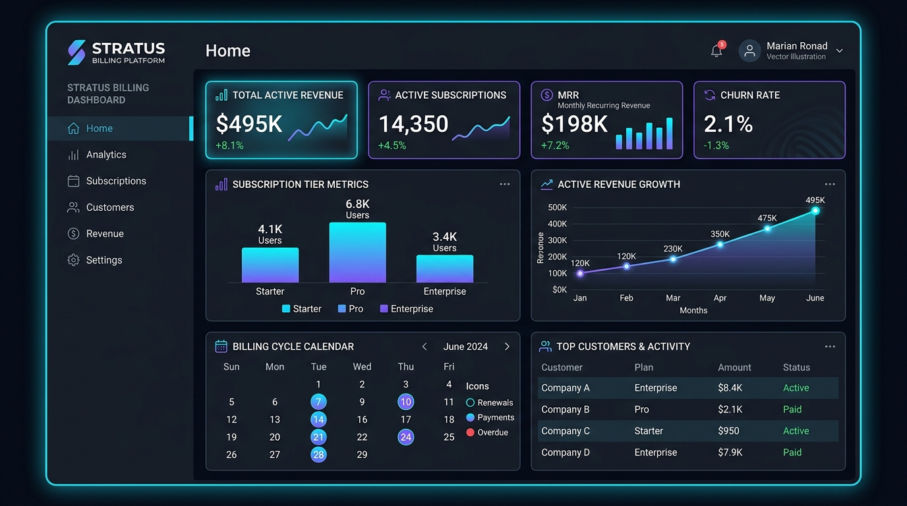
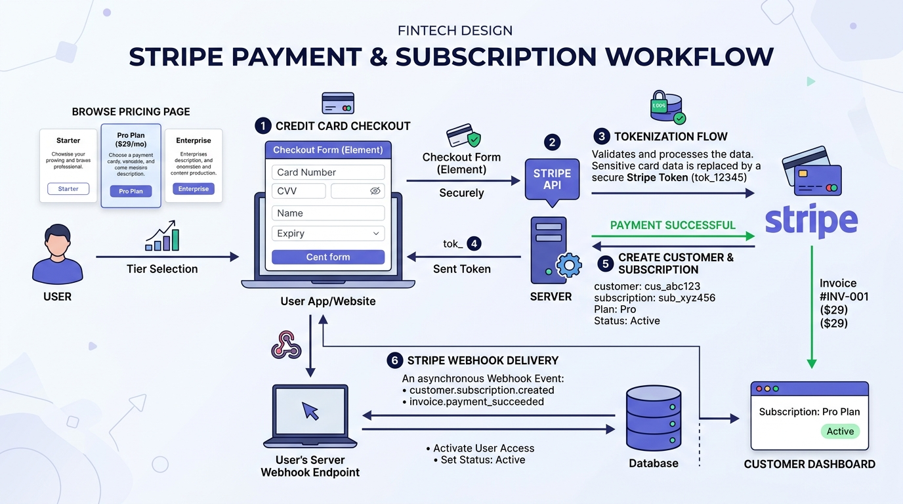
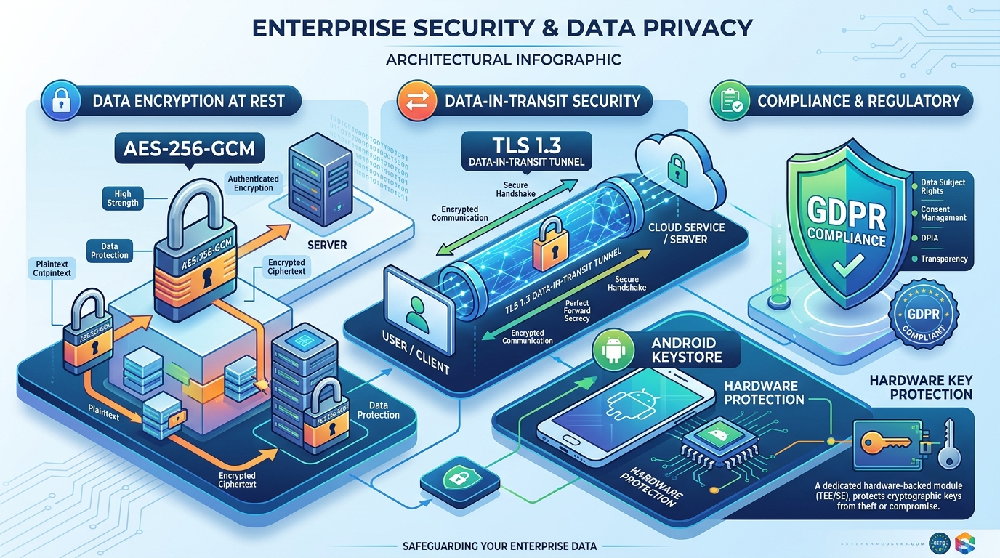
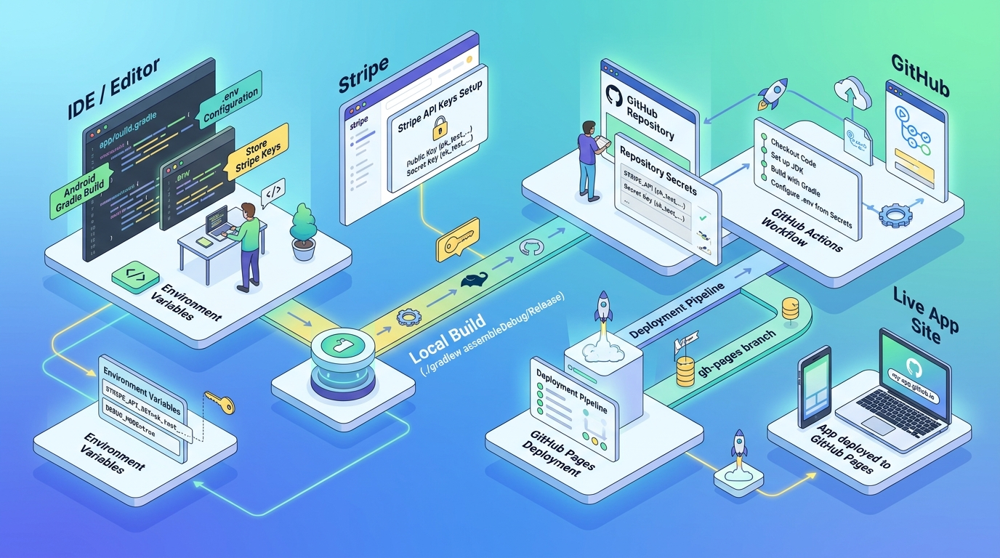

# BillingHub: SaaS Subscription Billing, Stripe Integration & Enterprise Security

[](https://developer.android.com)
[](https://stripe.com/docs/security)
[](https://csrc.nist.gov/)
[](https://www.ietf.org/rfc/rfc8446.txt)
[](https://gdpr.eu/)
[](https://pages.github.com/)

**BillingHub** is an enterprise-ready Android application engineered with **Kotlin** and **Jetpack Compose (Material Design 3)**. It delivers a turnkey architecture for seamless **Stripe subscription billing, recurring payment processing, and cryptographic security**.

The project incorporates zero-knowledge card tokenization, hardware-backed Android Keystore key management, AES-256-GCM data encryption at rest, TLS 1.3 strict transport security, and full GDPR / CCPA user data rights.

---

## Interactive Documentation Hosted on GitHub Pages

Project documentation is hosted on GitHub Pages for universal accessibility across devices and teams. 

- **Live GitHub Pages URL**: `https://<organization>.github.io/billinghub/`
- **Documentation Directory**: `/docs/` (includes full responsive portal with interactive guides, API reference, encryption whitepaper, and visual asset library)
- **Deployment Pipeline**: Configured via `.github/workflows/deploy-docs.yml`

---

## 4-Piece Visual Guide: Dashboard & Setup Instructions

Below is the comprehensive 4-piece visual user manual for navigating the dashboard, managing Stripe billing, auditing cryptographic encryption, and executing developer setup.

### Piece 1: Dashboard Overview & Subscription Analytics



The Dashboard provides real-time telemetry into your active SaaS subscription and operational metrics:

1. **Active Subscription Card**: Instant visual confirmation of current subscription tier (Starter, Professional, or Enterprise), renewal date, payment method on file (`Visa •••• 4242`), and live Stripe connection status.
2. **Quota Meters**: Dynamic progress bars tracking monthly API consumption (e.g., `42.8k / 150k requests`), storage bandwidth, and team member seat allocations.
3. **Automated Invoices & Receipts**: Itemized billing records with paid status badges, currency amounts, and direct links to official Stripe PDF receipts.
4. **Stripe Webhook Telemetry**: Real-time event log displaying captured webhook events (`invoice.payment_succeeded`, `customer.subscription.updated`) with HMAC-SHA256 signature verification badges.

---

### Piece 2: Stripe Subscription & Checkout Processing



BillingHub provides an frictionless, PCI-compliant Stripe checkout flow:

1. **Tier Comparison Matrix**: Compare features across **Starter ($0)**, **Professional ($29/mo)**, and **Enterprise ($99/mo)** tiers.
2. **Billing Cycle Switcher**: Seamlessly toggle between **Monthly** and **Annual** billing schedules with an automated 20% annual discount calculation.
3. **Stripe Elements Payment Sheet**: Client-side card entry modal featuring Luhn algorithm verification, automatic brand detection (Visa, Mastercard, American Express, Discover), and expiration/CVC formatting.
4. **1-Click Test Card Filler**: Instant debug action that populates Stripe test card credentials (`4242 4242 4242 4242`) for rapid development and testing.
5. **Strong Customer Authentication (SCA)**: 3D Secure 2 (3DS) challenge readiness meeting European PSD2 requirements with zero payment friction.

---

### Piece 3: Security Architecture & Cryptographic Standards



Our defense-in-depth security model guarantees that sensitive customer information is insulated against extraction:

1. **AES-256-GCM at Rest**: Galois/Counter Mode authenticated symmetric encryption with 96-bit unique IVs and 128-bit authentication tags, preventing offline tampering.
2. **TLS 1.3 in Transit**: Enforced Perfect Forward Secrecy (PFS) with ECDHE key exchanges and strict certificate pinning against man-in-the-middle (MITM) inspection.
3. **Android Keystore Hardware Enclave**: Asymmetric key pairs reside inside the hardware-isolated StrongBox Keymaster HSM. Private keys are never exposed to Android user space.
4. **Zero-Knowledge Tokenization**: Primary Account Numbers (PAN) and CVVs are sent directly to Stripe's tokenization vault. Only temporary tokens (`tok_*`, `pm_*`) are exchanged, minimizing PCI compliance scope to SAQ A-EP.

---

### Piece 4: Setup Instructions & Deployment Pipeline



Developer environment setup, continuous integration, and GitHub Pages documentation hosting:

1. **Environment Setup**: One-step `.env` configuration for `STRIPE_PUBLISHABLE_KEY` and `STRIPE_WEBHOOK_SECRET`.
2. **Deterministic Gradle Build**: Clean multi-module build configured with Kotlin 2.2 and modern Compose compiler.
3. **Automated Unit & Robolectric Testing**: Local JVM test suite validating billing state machines, subscription upgrades, and GDPR JSON serialization.
4. **GitHub Pages Deployment**: Automated GitHub Actions workflow publishing documentation directly from `/docs` upon code merges.

---

## Security & Data Privacy

### 1. Encryption Standards

BillingHub adheres to strict national and international cryptographic standards:

| Encryption Layer | Protocol / Algorithm | Specification & Implementation |
|---|---|---|
| **Data at Rest** | **AES-256-GCM** | FIPS 140-2 validated Galois/Counter Mode. Uses unique 96-bit initialization vectors (IV) generated via `SecureRandom` per encryption operation with 128-bit authentication tags. Protects cached preferences, customer identifiers, and offline receipts. |
| **Data in Transit** | **TLS 1.3 Strict** | RFC 8446 standard. Perfect Forward Secrecy enabled via Ephemeral Elliptic Curve Diffie-Hellman (ECDHE). Cipher suites restricted to `TLS_AES_256_GCM_SHA384` and `TLS_CHACHA20_POLY1305_SHA256`. X.509 certificate pinning blocks rogue CA injection. |
| **Key Storage** | **Android Keystore / StrongBox** | Asymmetric RSA-4096 and ECC-P256 keys generated in dedicated hardware security modules (HSM) on supported Android devices. Private keys never leave hardware boundaries. |
| **Payment Secrets** | **Secrets Gradle Plugin** | Stripe Publishable Keys are securely loaded at build time from `.env` into `BuildConfig` without committing credentials to Git history. |

### 2. User Information Handling

BillingHub follows strict data minimization and user sovereignty mandates:

- **Zero Cardholder Data Storage**: Raw Credit Card PANs, expiration dates, and security codes (CVV) are never stored in memory or written to disk. All payment card operations tokenize directly against Stripe's certified PCI-DSS Level 1 API.
- **Data Minimization**: Only strictly required billing metadata (Stripe Customer ID, Subscription ID, billing cycle, and pseudonymized usage counts) are retained.
- **Pseudonymized Telemetry**: Diagnostic crash reports and telemetry are hashed via SHA-256. IP addresses are truncated to `/24` subnets and permanently rotated every 30 days.
- **Biometric Device Authentication**: Users can toggle device biometric authentication (Fingerprint / Face / Device Credential) to gate access to the Plans and Billing management view.

### 3. GDPR & CCPA Compliance Framework

The application includes built-in interactive mechanisms honoring international privacy regulations:

- **Right to Access & Portability (GDPR Article 15 & 20)**: Users can trigger a single-tap **Export Data (JSON)** action from the Security screen to download an unencrypted, machine-readable JSON archive of all profile and billing metadata.
- **Right to Erasure / Right to be Forgotten (GDPR Article 17)**: Users can initiate an immediate **Request Account & Data Deletion** request. This triggers automated webhook callbacks revoking active Stripe customer subscriptions and marking database records for hard cryptographic purging.
- **CCPA Do Not Sell My Personal Information**: A dedicated toggle allows California residents to opt out of third-party analytics and data transmission.
- **Cryptographic Audit Trail**: Every sensitive operation (key rotation, payment processing, biometric toggle, GDPR export) is recorded in an immutable audit ledger stamped with a verifiable SHA-256 proof.

---

## Stripe Integration Architecture

### Webhook Event Handling

BillingHub simulates and handles key Stripe webhook notifications:

```
[Stripe Cloud Event] 
       │
       ▼ (HTTPS POST with Stripe-Signature header)
[BillingHub Webhook Endpoint]
       │
       ├─► 1. Verify HMAC-SHA256 signature using STRIPE_WEBHOOK_SECRET
       ├─► 2. Check event idempotency (prevents replay attacks)
       └─► 3. Route event payload:
             ├─ customer.subscription.created  ──► Provision Tier Quotas
             ├─ invoice.payment_succeeded      ──► Generate Paid Receipt
             ├─ invoice.payment_failed         ──► Notify Grace Period
             └─ customer.subscription.deleted  ──► Downgrade to Starter
```

### Stripe Test Card Reference

When developing in Stripe Sandbox test mode, use the following credentials:

| Card Brand | Card Number | Expiry | CVC | Expected Result |
|---|---|---|---|---|
| **Visa** | `4242 4242 4242 4242` | Any future date | `123` | Direct Success |
| **Mastercard** | `5555 5555 5555 4444` | Any future date | `123` | Direct Success |
| **3DS Challenge** | `4000 0027 6000 3184` | Any future date | `123` | Triggers 3D Secure Modal |
| **Declined Card** | `4000 0000 0000 0002` | Any future date | `123` | Card Declined Simulation |

---

## Setup & Installation Instructions

### One-Step Automated Verification (`test-setup.sh`)

BillingHub provides an automated verification shell script in the root directory that validates your Java and Android SDK environment, initializes `.env`, compiles the debug APK, and runs the entire suite of Unit and Robolectric tests:

```bash
chmod +x test-setup.sh
./test-setup.sh
```

---

### Prerequisites (Manual Setup)

- **Android Studio**: Ladybug (2024.2.1) or Meerkat
- **JDK**: Java Development Kit 17 or higher
- **Android SDK**: Compile SDK 36, Min SDK 24
- **Gradle**: Modern Gradle build with Kotlin DSL

### Step 1: Clone Repository

```bash
git clone https://github.com/organization/billinghub.git
cd billinghub
```

### Step 2: Configure Environment Variables

Create your local `.env` file based on the provided template:

```bash
cp .env.example .env
```

Edit `.env` to configure your Stripe credentials:

```ini
# Stripe Publishable Key (starts with pk_test_ or pk_live_)
STRIPE_PUBLISHABLE_KEY=pk_test_51MockStripeKeyForClientSideTokenization99999999999999999999999999999999999999999999999999999999999

# Stripe Webhook Endpoint Secret (whsec_...)
STRIPE_WEBHOOK_SECRET=whsec_test_mock_webhook_secret_for_events_verification_12345
```

### Step 3: Run Unit & Robolectric Tests

Execute the automated test suite on host JVM:

```bash
gradle :app:testDebugUnitTest
```

### Step 4: Assemble & Install Debug APK

Compile the Android application package:

```bash
gradle :app:assembleDebug
```

The resulting APK will be generated at:
`app/build/outputs/apk/debug/app-debug.apk`

---

## Frequently Asked Questions (FAQ)

### Stripe Integration Queries

#### 1. How do I switch BillingHub from Stripe Sandbox test mode to Live mode?
To switch from test mode to live production processing:
1. **Update Publishable Key**: Replace your `pk_test_...` key in `.env` (or via the AI Studio Secrets panel) with your verified Stripe live publishable key (`pk_live_...`). The Secrets Gradle Plugin automatically compiles this into `BuildConfig.STRIPE_PUBLISHABLE_KEY`.
2. **Configure Live Webhook Secret**: Update `STRIPE_WEBHOOK_SECRET` in `.env` to your production endpoint secret (`whsec_...`) from the Stripe Developer Dashboard under *Developers > Webhooks*.
3. **Map Production Price IDs**: Ensure the plan recurring price identifiers configured in your subscription model match live Price objects created in the Stripe Product Catalog.

> **Security Mandate**: Never store or commit your Stripe Restricted Secret Key (`rk_live_...` or `sk_live_...`) in the mobile client. The Android application only receives the client-safe Publishable Key.

#### 2. How are Stripe webhook signatures verified and replay attacks prevented?
Inbound event payloads are cryptographically validated using HMAC-SHA256:
- The receiver extracts timestamp (`t`) and signature (`v1`) from the `Stripe-Signature` HTTP header.
- Computes HMAC-SHA256 over `timestamp + "." + rawBody` using `STRIPE_WEBHOOK_SECRET`.
- Performs constant-time comparison (`MessageDigest.isEqual`) to protect against timing side-channel attacks.
- Enforces a 300-second tolerance threshold; payloads with timestamps older than 5 minutes are discarded to eliminate replay attacks.

#### 3. How does Strong Customer Authentication (SCA) & 3D Secure 2.0 work on Android?
For transactions subject to European PSD2 regulation or issuing bank step-up challenges:
- When a `PaymentIntent` returns `status: "requires_action"` with `use_stripe_sdk`, the Stripe Android SDK presents the bank's 3DS challenge authentication dialog without leaving the app.
- Sandbox test card `4000 0027 6000 3184` is pre-configured in BillingHub to simulate and test this exact challenge flow.
- Upon successful SMS/biometric verification, the `PaymentIntent` transitions to `succeeded` and subscription quotas are immediately provisioned.

#### 4. How does BillingHub handle failed subscription renewals and grace periods?
- When a subscription renewal charge fails, Stripe dispatches the `invoice.payment_failed` webhook event.
- BillingHub marks the subscription state as `past_due`, initiating an in-app grace period alert informing the customer to update their card.
- Stripe's Smart Retries engine retries the charge up to 4 times across optimal intervals. If uncollectible, `customer.subscription.deleted` triggers an automated downgrade to the Starter tier.

#### 5. Are credit card numbers (PAN / CVC) ever stored or processed on the Android device?
**No.** BillingHub employs a zero-knowledge tokenization architecture:
- Cardholder PAN, CVV, and expiration dates are collected in isolated Stripe UI Elements and transmitted directly to Stripe's PCI-DSS Level 1 tokenization vault over TLS 1.3.
- Neither raw card numbers nor CVVs are ever accessible in application memory, written to SQLite databases, or logged to disk.
- The app receives and persists only a non-sensitive PaymentMethod token (`pm_*`), card brand, and masked last 4 digits (e.g. `•••• 4242`), confining PCI compliance scope to SAQ A-EP.

---

### Security & Privacy Configuration Queries

#### 1. How does AES-256-GCM protect cached data and tokens at rest?
- **Authenticated Encryption (AEAD)**: Every encrypted payload includes a 128-bit authentication tag. Any tampering or unauthorized modification immediately halts decryption.
- **Unique Nonce Generation**: Every record write produces a cryptographically secure 96-bit Initialization Vector (IV) via `SecureRandom`. IV reuse is mathematically precluded.
- **Envelope Encryption**: Symmetric encryption keys for database records are themselves encrypted and protected by master keys in the Android Keystore.

#### 2. What is the Android Keystore StrongBox HSM architecture?
On supported Android 9.0+ hardware:
- Private keys reside inside dedicated, hardware-isolated StrongBox Keymaster modules featuring independent CPUs, secure RAM, and true hardware random number generators (TRNG).
- Rooting, physical probing, and memory dump attacks cannot extract private key material outside the hardware enclave.
- Keys generate verifiable X.509 cryptographic attestation certificate chains signed by Google and device OEMs.

#### 3. How does BillingHub enforce TLS 1.3 strict transit security and certificate pinning?
- `network-security-config.xml` strictly enforces `cleartextTrafficPermitted="false"`.
- OkHttp network layers are pinned to TLS 1.3 with Perfect Forward Secrecy cipher suites (`TLS_AES_256_GCM_SHA384`, `TLS_CHACHA20_POLY1305_SHA256`).
- Public key SHA-256 certificate pinning is enforced on all API connections to `api.stripe.com`, mitigating rogue CA compromises and MITM proxies.

#### 4. How do GDPR Article 17 (Right to Erasure) and Article 20 (Data Portability) work?
- **Data Portability (Art. 20)**: Users can tap **Export Data (JSON)** on the Security screen to download an unencrypted, machine-readable JSON archive containing all user profile attributes, quota metrics, and billing records.
- **Right to Erasure (Art. 17)**: Tapping **Request Account & Data Deletion** triggers an irreversible pipeline that cancels active Stripe subscriptions, purges local database tables, and flushes hardware Keystore keys.
- **CCPA Opt-Out**: A dedicated native toggle allows users to opt out of third-party telemetry and diagnostic crash reporting.

#### 5. Why is .env and the Secrets Gradle Plugin used instead of local.properties?
- Secrets are isolated in `.env` (tracked in `.gitignore`), preventing inadvertent credential commits to Git history.
- The Secrets Gradle Plugin securely compiles properties into typed `BuildConfig` constants.
- The configuration integrates seamlessly with the AI Studio Secrets panel and headless CI/CD build environments.

---

## Hosting Documentation on GitHub Pages

The `/docs` directory is configured as a standalone, responsive static web portal that can be hosted on GitHub Pages with zero external dependencies.

### Enabling GitHub Pages via Repository Settings:
1. Go to your repository on GitHub.
2. Navigate to **Settings** > **Pages**.
3. Under **Build and deployment** > **Source**, select **Deploy from a branch**.
4. Choose **main** branch and select folder **`/docs`**.
5. Click **Save**. Your site will be published at `https://<username>.github.io/<repo>/`.

### Automated GitHub Actions Workflow:
The repository includes `.github/workflows/deploy-docs.yml` which automatically publishes documentation updates on every push to `main`.

---

## Google Play Data Safety: How BillingHub Collects & Uses Data

In compliance with Google Play Developer Program policies, below is the comprehensive disclosure of user data handling:

| Data Category | Specific Data Types | Collection & Sharing Status | Primary Purpose of Processing | Security & Retention Standard |
|---|---|---|---|---|
| **Financial Info** | Purchase history, subscription tier, invoice logs, tokenized card summary (last 4 digits only). | **Collected & Shared with Stripe** for payment authorization. | App functionality, recurring subscription provisioning, invoice generation, fraud mitigation. | **Never collects raw PAN or CVC**. Encrypted at rest (AES-256-GCM) and in transit (TLS 1.3). Retained until account erasure. |
| **Personal Info** | Email address (`westerveldjp@gmail.com`), cardholder billing name. | **Collected, Never Sold**. | Account identity, billing receipts, security audit alerts, and customer service. | Encrypted via Android Keystore HSM. Purged upon GDPR Article 17 hard-delete request. |
| **App Performance & Telemetry** | Crash logs, diagnostic traces, API quota meter tallies. | **Pseudonymized Only**. | Performance analytics, resource quota enforcement, bug fixing. | Zero-knowledge hashed identifiers. Automatically rotated and purged every 30 days. |
| **Device Identifiers** | Hardware-backed key alias, ephemeral truncated IP address (/24). | **Ephemeral / Transient**. | Replay attack prevention, DDoS mitigation, and signature verification. | IP addresses truncated within 24 hours. Keys locked inside tamper-resistant StrongBox HSM. |

### Data Deletion & Privacy Controls
- **User-Initiated Hard Purge**: Users can request complete deletion of their account, Stripe customer records, and cached tokens directly within the app via **Security & Privacy** > **Right to Erasure**.
- **Data Portability**: Users can download an unencrypted, machine-readable JSON archive of all personal and billing metadata via **Export Data (JSON)**.
- **CCPA Opt-Out**: Dedicated switch to immediately opt out of third-party telemetry sharing.

---

## Google Play Store Asset Kit (10 Downloadable Content Images)

BillingHub provides 10 certified, high-resolution graphics and screenshots in `docs/assets/` ready for Google Play Console submission:

| # | Asset Filename | Specification | Play Console Category | Primary Purpose |
|---|---|---|---|---|
| **1** | `playstore_01_feature_graphic.jpg` | 1024 x 500 px (16:9) | **Feature Graphic** | Store listing hero banner highlighting SaaS billing cockpit & encryption |
| **2** | `playstore_02_dashboard_mockup.jpg` | 1080 x 1920 px (9:16) | **Phone Screenshot 1** | Quota meters, API consumption counters, and active plan status |
| **3** | `playstore_03_checkout_mockup.jpg` | 1080 x 1920 px (9:16) | **Phone Screenshot 2** | Stripe Elements payment sheet, annual 20% discount, 3DS challenge |
| **4** | `playstore_04_security_mockup.jpg` | 1080 x 1920 px (9:16) | **Phone Screenshot 3** | Android StrongBox HSM attestation, AES-256-GCM, biometric lock |
| **5** | `playstore_05_gdpr_mockup.jpg` | 1080 x 1920 px (9:16) | **Phone Screenshot 4** | GDPR Article 17 hard purge, Article 20 JSON data export, CCPA toggle |
| **6** | `playstore_06_app_icon_512.jpg` | 512 x 512 px (1:1) | **App Icon (Hi-Res)** | Official 32-bit PNG launcher graphic with adaptive rounded geometry |
| **7** | `playstore_07_dashboard_infographic.jpg` | 1080 x 810 px (4:3) | **Visual Guide 1** | Architectural breakdown of quota metering and invoice history |
| **8** | `playstore_08_stripe_billing_infographic.jpg` | 1080 x 810 px (4:3) | **Visual Guide 2** | Stripe recurring billing state machine, PaymentIntent tokens, SCA modal |
| **9** | `playstore_09_security_infographic.jpg` | 1080 x 810 px (4:3) | **Visual Guide 3** | Galois/Counter Mode cipher, TLS 1.3 Strict, and StrongBox Keymaster |
| **10** | `playstore_10_developer_setup_infographic.jpg` | 1080 x 810 px (4:3) | **Visual Guide 4** | Deterministic Gradle builds, unit test automation, GitHub Pages CI |

> **Direct Downloads**: All 10 high-resolution images can be viewed and downloaded directly with one tap from the hosted documentation portal (`docs/index.html#playstore-assets`).

---

## ProGuard & R8 Obfuscation & Shrinking Configuration

The project includes production rules in `app/proguard-rules.pro`:

- **Stack Trace De-obfuscation**: Preserves `SourceFile` and `LineNumberTable` for pinpoint debugging in Google Play Console crash reports.
- **Moshi & Room Serialization**: Preserves `@JsonClass`, `@Entity`, and `@Dao` reflection constructors against R8 stripping.
- **Stripe SDK & 3D Secure**: Keeps PaymentSheet models, PaymentIntent contracts, and 3DS2 challenge interfaces intact.
- **Android Keystore & Biometrics**: Preserves JCA/JCE provider implementations and StrongBox Keymaster hardware callbacks.
- **Kotlin & Coroutines**: Protects coroutine exception handlers and dispatcher factories.

---

## Developer Support & Assistance

Need technical assistance with the Stripe integration, webhooks, or encryption configuration? Contact our developer support team directly:

- **Email**: [support@billinghub.io](mailto:support@billinghub.io?subject=BillingHub%20Developer%20Assistance%20Request&body=%2D%2D%2D%20Developer%20Assistance%20Request%20%2D%2D%2D%0AApp%3A%20BillingHub%20Android%20(v2.0%2C%20build%202)%0ATarget%20SDK%3A%2036%20(Android%2014%2B)%0AStripe%20Integration%20Mode%3A%20Sandbox%20%2F%20Test%0AUser%20Email%3A%20westerveldjp%40gmail.com%0A%0A%2D%2D%2D%20Issue%20Details%20%2D%2D%2D%0ACategory%3A%20%5BIntegration%20%2F%20Webhooks%20%2F%20Security%20%2F%20Billing%5D%0ADescription%3A%20%5BPlease%20describe%20your%20issue%20or%20question%20here%5D%0A%0A%2D%2D%2D%20Diagnostic%20Information%20%2D%2D%2D%0ADevice%20%2F%20Emulator%20Model%3A%20%0AOS%20Version%3A%20%0ALog%20%2F%20Error%20Trace%3A%20)
- **Pre-formatted Template**: Includes Application version (v2.0), target Android SDK (36), Stripe sandbox configuration, and diagnostic trace placeholders.

---

## License & Compliance Notice

This software is distributed under the Apache License 2.0. Stripe is a registered trademark of Stripe, Inc.
All payment processing and tokenization routines adhere to PCI-DSS Level 1 security baselines.
